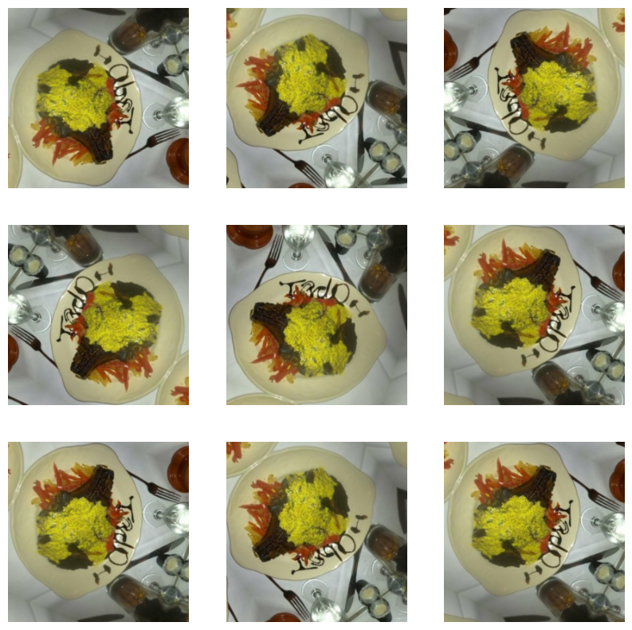

# Data Augmentation

## Summary

- what is data augmentation
- how to do data augmentation
- applying data augmentation
  - applying to pre-processing layers to the data set
  - applying to the model layers itself

## Content

### What is Data Augmentation

Data augmentation is a technique in machine learning used to reduce overfitting
when training a machine learning model, by training models on several
slightly-modified copies of existing data

### How to Do Data Augmentation

Data augmentation can be done as a part of the model itself.

**NOTE:** That data augmentation is only active when `Model.fit` for obvious
reasons. When calling `Model.evaluate` or `Model.predict`, augmentation layers
will be inactive

**NOTE:** Even though, the augmentation layers are inactive, layers such as
`Rescaling` & `Resizing` layers will be active.

```python
import tensorflow as tf
import matplotlib.pyplot as plt

data_augmentation = tf.keras.Sequential(
    [
        tf.keras.layers.Rescaling(1 / 255),
        tf.keras.layers.RandomRotation(0.2),
        tf.keras.layers.RandomFlip("horizontal_and_vertical"),
    ]
)

plt.figure(figsize=(10, 10))

for i in range(9):
    augmented_image = data_augmentation(tf.expand_dims(image, 0))
    ax = plt.subplot(3, 3, i + 1)
    plt.imshow(augmented_image[0])
    plt.axis("off")
```



### Applying Data Augmentation

Data augmentation can be defined as a sequence of layers and applied to the
model

#### Define pre-processing & data augmentation layers

```python
import tensorflow as tf
import matplotlib.pyplot as plt
import pandas as pd

IMG_SIZE = 180

img_preprocessing = tf.keras.Sequential(
    [
        # image resizing can be done in the model so when predicting the image
        # will be auto  resized
        tf.keras.layers.Resizing(IMG_SIZE, IMG_SIZE),
        tf.keras.layers.Rescaling(1.0 / 255),
    ]
)

data_augmentation = tf.keras.Sequential(
    [
        tf.keras.layers.RandomFlip("horizontal"),
        tf.keras.layers.RandomRotation(0.2),
        tf.keras.layers.RandomZoom(0.2),
    ]
)
```

#### Building the model

```python
model = tf.keras.Sequential(
    [
        img_preprocessing,
        data_augmentation,
        tf.keras.layers.Conv2D(10, 3, activation="relu", input_shape=(180, 180, 3)),
        tf.keras.layers.MaxPooling2D(),
        tf.keras.layers.Conv2D(10, 3, activation="relu"),
        tf.keras.layers.MaxPooling2D(),
        tf.keras.layers.Conv2D(20, 3, activation="relu"),
        tf.keras.layers.MaxPooling2D(),
        tf.keras.layers.Flatten(),
        tf.keras.layers.Dense(1, activation="sigmoid"),
    ]
)

model.compile(
    loss=tf.keras.losses.BinaryCrossentropy(),
    optimizer=tf.keras.optimizers.Adam(),
    metrics=["accuracy"],
)

history = model.fit(train_data, epochs=4, validation_data=test_data)
```
