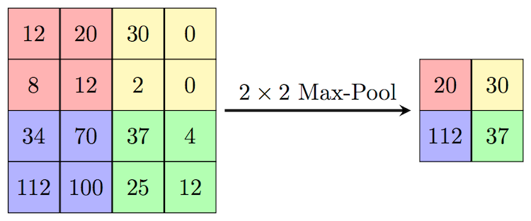

# Max Pooling Layer

## Summary

- what is max pooling
- CNN without max pooling layers
- CNN with max pooling layers
- CNN without max pooling vs with max pooling

## Content

### What is Max Pooling

Max Pooling is a pooling operation that calculates the maximum value for patches
of a feature map, and uses it to create a downsampled (pooled) feature map.

If the patch size is two, max pooling will perform sliding window with a (2 x 2)
matrix and get the max value of the patch window to get the new feature. So,
feature map size will be reduced by half after the max pooling layer.

In following example, max pooling layers reduce the feature map by 50x but
improve the accuracy.



### CNN without max pooling layers

```python
import tensorflow as tf
import pandas as pd

model = tf.keras.Sequential(
    [
        tf.keras.layers.Conv2D(
            filters=10,
            kernel_size=3,  # 3 == (3, 3)
            padding="valid",
            activation="relu",
            input_shape=(224, 224, 3),
        ),
        tf.keras.layers.Conv2D(10, 3),  # (filters, kernel_size)
        tf.keras.layers.Conv2D(10, 3),
        tf.keras.layers.Flatten(),
        tf.keras.layers.Dense(1, activation="sigmoid"),
    ]
)

model.compile(
    loss=tf.keras.losses.BinaryCrossentropy(),
    optimizer=tf.keras.optimizers.Adam(),
    metrics=["accuracy"],
)

model.summary()

history = model.fit(
    train_data,
    epochs=4,
    steps_per_epoch=len(train_data),
    validation_data=valid_data,
    validation_steps=len(valid_data),
)
```

```text
_________________________________________________________________
 Layer (type)                Output Shape              Param #   
=================================================================
 conv2d_25 (Conv2D)          (None, 222, 222, 10)      280       
                                                                 
 conv2d_26 (Conv2D)          (None, 220, 220, 10)      910       
                                                                 
 conv2d_27 (Conv2D)          (None, 218, 218, 10)      910       
                                                                 
 flatten_9 (Flatten)         (None, 475240)            0         
                                                                 
 dense_11 (Dense)            (None, 1)                 475241    
                                                                 
=================================================================
Total params: 477341 (1.82 MB)
Trainable params: 477341 (1.82 MB)
Non-trainable params: 0 (0.00 Byte)
_________________________________________________________________
```

```text
Epoch 1/4
47/47 [==============================] - 8s 111ms/step - loss: 254.3925 - 
accuracy: 0.6420 - val_loss: 54.5351 - val_accuracy: 0.7240
Epoch 2/4
47/47 [==============================] - 4s 76ms/step - loss: 24.7303 - 
accuracy: 0.8340 - val_loss: 36.6056 - val_accuracy: 0.7260
Epoch 3/4
47/47 [==============================] - 5s 104ms/step - loss: 5.8424 - 
accuracy: 0.9200 - val_loss: 35.2553 - val_accuracy: 0.7320
Epoch 4/4
47/47 [==============================] - 5s 90ms/step - loss: 3.5921 - 
accuracy: 0.9527 - val_loss: 34.2759 - val_accuracy: 0.7200
```

### CNN with max pooling layers

```python
model = tf.keras.Sequential(
    [
        tf.keras.layers.Conv2D(
            filters=10,
            kernel_size=3,
            padding="valid",
            strides=1,
            activation="relu",
            input_shape=(224, 224, 3),
        ),
        tf.keras.layers.MaxPooling2D(),
        tf.keras.layers.Conv2D(10, 3, activation="relu"),
        tf.keras.layers.MaxPooling2D(),
        tf.keras.layers.Conv2D(10, 3, activation="relu"),
        tf.keras.layers.MaxPooling2D(),
        tf.keras.layers.Flatten(),
        tf.keras.layers.Dense(1, activation="sigmoid"),
    ]
)

model.compile(
    loss=tf.keras.losses.BinaryCrossentropy(),
    optimizer=tf.keras.optimizers.Adam(),
    metrics=["accuracy"],
)

model.summary()

history = model.fit(
    train_data,
    epochs=4,
    steps_per_epoch=len(train_data),
    validation_data=valid_data,
    validation_steps=len(valid_data),
)
```

```text
_________________________________________________________________
 Layer (type)                Output Shape              Param #   
=================================================================
 conv2d_48 (Conv2D)          (None, 222, 222, 10)      280       
                                                                 
 max_pooling2d_12 (MaxPooli  (None, 111, 111, 10)      0         
 ng2D)                                                           
                                                                 
 conv2d_49 (Conv2D)          (None, 109, 109, 10)      910       
                                                                 
 max_pooling2d_13 (MaxPooli  (None, 54, 54, 10)        0         
 ng2D)                                                           
                                                                 
 conv2d_50 (Conv2D)          (None, 52, 52, 10)        910       
                                                                 
 max_pooling2d_14 (MaxPooli  (None, 26, 26, 10)        0         
 ng2D)                                                           
                                                                 
 flatten_17 (Flatten)        (None, 6760)              0         
                                                                 
 dense_21 (Dense)            (None, 1)                 6761      
                                                                 
=================================================================
Total params: 8861 (34.61 KB)
Trainable params: 8861 (34.61 KB)
Non-trainable params: 0 (0.00 Byte)
```

```text
Epoch 1/4
47/47 [==============================] - 5s 75ms/step - loss: 4.2812 - accuracy:
0.5753 - val_loss: 0.7005 - val_accuracy: 0.6620
Epoch 2/4
47/47 [==============================] - 5s 88ms/step - loss: 0.6440 - accuracy:
0.6927 - val_loss: 0.6552 - val_accuracy: 0.7020
Epoch 3/4
47/47 [==============================] - 4s 72ms/step - loss: 0.5104 - accuracy:
0.7533 - val_loss: 0.5547 - val_accuracy: 0.7540
Epoch 4/4
47/47 [==============================] - 6s 123ms/step - loss: 0.4084 - accuracy:
0.8207 - val_loss: 0.5677 - val_accuracy: 0.7440
```
