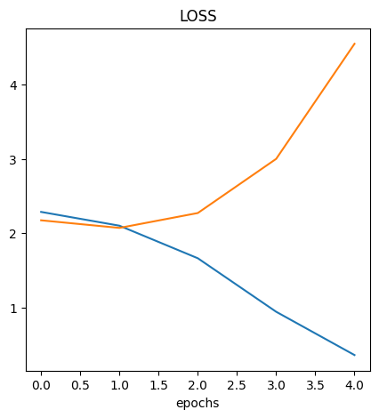
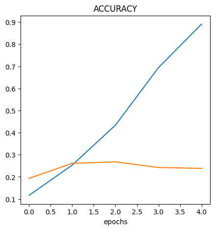
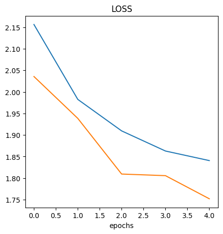
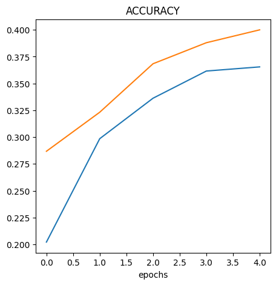

# Evaluating Model Loss Curve

## Summary

- Visualize the model results
- Understanding what's causing the inaccuracy
- How to resolve the issue
  - Get more data
  - Simplify the model - reduce # of layers of # of hidden layers
  - Generalizing - data augmentation
  - Transfer learning

## Content

### Visualize the Model Results

```python
import matplotlib.pyplot as plt
import pandas as pd

loss = history.history["loss"]
val_loss = history.history["val_loss"]

acc = history.history["accuracy"]
val_acc = history.history["val_accuracy"]

epochs = range(len(history.history["loss"]))

plt.figure(figsize=(10, 7))
plt.plot(epochs, loss)
plt.plot(epochs, val_loss)
plt.title("LOSS")
plt.xlabel("epochs")

plt.figure(figsize=(10, 7))

plt.plot(epochs, acc)
plt.plot(epochs, val_acc)
plt.title("ACCURACY")
plt.xlabel("epochs")
```





### Understanding What's Causing the Inaccuracy

Up to some point the `val_loss` and `val_accuracy` follows the `loss` and
`accuracy` however, they deviates at some point. This is an indication of
`overfitting`

### How to Resolve the Issue

#### Data Augmentation

- To avoid overfitting, we can do data augmentation

```python
data_augmentation = tf.keras.Sequential(
    [
        tf.keras.layers.RandomFlip("horizontal"),
        tf.keras.layers.RandomZoom(0.1),
        tf.keras.layers.RandomRotation(0.1),
    ]
)

model = tf.keras.Sequential(
    [
        tf.keras.layers.Resizing(180, 180),
        tf.keras.layers.Rescaling(1.0 / 255),
        data_augmentation,
        tf.keras.layers.Conv2D(10, 3, activation="relu"),
        tf.keras.layers.Conv2D(10, 3, activation="relu"),
        tf.keras.layers.MaxPooling2D(),
        tf.keras.layers.Conv2D(10, 3, activation="relu"),
        tf.keras.layers.Conv2D(10, 3, activation="relu"),
        tf.keras.layers.MaxPooling2D(),
        tf.keras.layers.Flatten(),
        tf.keras.layers.Dense(len(class_names), activation="softmax"),
    ]
)
```




