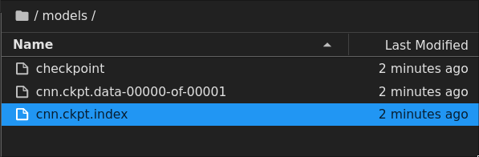

# Save & Load Model Weights

## Summary

- Save weights
- Load weights

## Content

### Save Weights

- Checkpoint callback can be created as follows

```python
checkpoint_path = "models/cnn.ckpt"

model_checkpoint = tf.keras.callbacks.ModelCheckpoint(
    checkpoint_path,
    monitor="val_loss",
    save_weights_only=True,
    save_best_only=False,
    save_freq="epoch",
    verbose=1,
)
```

- Callback should be registerd to fit when training the model

```python
model.fit(
    train_data,
    epochs=4,
    steps_per_epoch=1,
    validation_data=test_data,
    callbacks=[model_checkpoint],
)
```

- Saved checkpoints are created like below



### Load Weights

- Create a new model of the same architecture & compile the model

```python
model_clone = tf.keras.models.clone_model(model)
model_clone.compile(
    loss=tf.keras.losses.SparseCategoricalCrossentropy(),
    optimizer=tf.keras.optimizers.Adam(),
    metrics=["accuracy"],
)
```

- Load the saved weights to the new model

```python
model_clone.evaluate(test_data)
# loss: 2.3026 - accuracy: 0.1036

model_clone.load_weights(checkpoint_path)
model_clone.evaluate(test_data)
# loss: 2.1837 - accuracy: 0.2152

model.evaluate(test_data)
# loss: 2.1837 - accuracy: 0.2152

# as you can see, after weights has been loaded to cloned model, both models
# prodeces the same predictions
```
